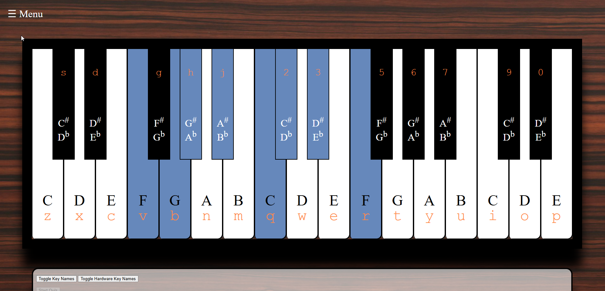

### Important Note: This repository contains an old version, the current is in the jbeardwo.github.io repository under MusicTheoryKeyboard
You can run a demo at https://jbeardwo.github.io/MusicTheoryKeyboard/static/html/intro.html

# Music-Theory-Keyboard

An interactive educational piano keyboard, designed to help users learn music theory concepts through hands-on practice.

---

##  Project Overview

Music-Theory-Keyboard is a web-based piano keyboard application that visually demonstrates music theory principles such as scales, chords, and note relationships. It aims to provide learners—whether beginners or intermediate musicians—with a fun and interactive way to understand music theory fundamentals by playing and exploring the keyboard.

---

##  Features

- Fully playable piano keyboard interface  
- Highlighting of scales, chords, and intervals  
- Real-time visual feedback on key presses  
- Intuitive UI built with React for responsive experience  
- Interactive lessons to teach music theory concepts

---

##  Technologies Used

- **JavaScrip** — application logic  
- **HTML5 & CSS3** — structure and styling  
- **MIDI.js** - handling sound

---
